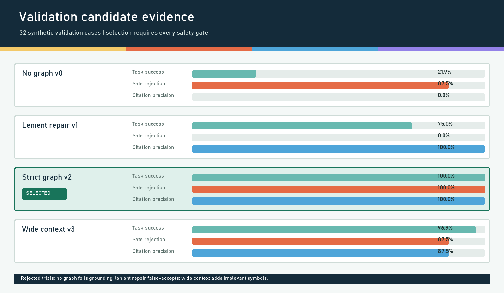
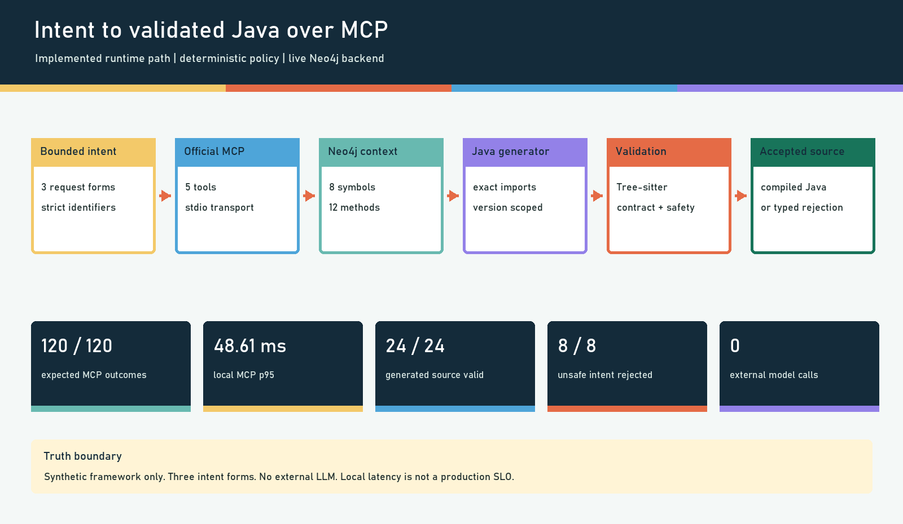

# Graph-Backed MCP Java Test Generation

[](https://github.com/rajendarmuddasani/GraphDB_GenAI_MCP_Test_Program_Development/actions/workflows/ci.yml)
[](pyproject.toml)
[](evidence/claims.json)
[](LICENSE)

A bounded natural-language request becomes graph-cited Java, then either passes syntax, contract, grounding, source-safety, and compilation gates or returns a typed rejection through an official MCP server.

> **Evidence boundary:** this is an independently generated synthetic framework with three supported intent forms and a deterministic generator. It does not call an external LLM, prove free-form language understanding, reproduce a proprietary framework, or establish a production SLO.

## Evidence Dashboard

| Surface | Accepted local evidence | Source |
|---|---:|---|
| Data contract | 96 CC0 synthetic intents; 32 development / 32 validation / 32 confirmation | [task evaluation](evidence/task_evaluation.json) |
| Confirmation task success | 32/32 bounded tasks | [case trace](evidence/evaluation_trace.json) |
| Generated-source validation | 24/24 supported intents | [task evaluation](evidence/task_evaluation.json) |
| Safe rejection | 8/8 adversarial or unsupported intents | [task evaluation](evidence/task_evaluation.json) |
| Grounding | 100% citation precision and required-symbol recall | [task evaluation](evidence/task_evaluation.json) |
| Live graph | Neo4j 5.26.29; 8 symbols; 12 methods | [Neo4j integration](evidence/neo4j_integration.json) |
| Official MCP | 120/120 expected outcomes; zero protocol errors | [MCP benchmark](evidence/mcp_benchmark.json) |
| Warm MCP latency | 29.13 / 48.61 / 54.23 ms p50 / p95 / p99, concurrency 1 | [MCP benchmark](evidence/mcp_benchmark.json) |
| Java compilation | Generated class plus seven synthetic stubs compiled | [compile evidence](evidence/java_compile.json) |
| External model use | 0 calls; $0 model API cost | [MCP benchmark](evidence/mcp_benchmark.json) |

Latency figures are single-process local Windows measurements, not production objectives.



## Selection, Not Just Generation

The selection objective was declared before confirmation: maximize validation task success among candidates passing **all** safety gates. Confirmation was opened only for the winner.

| Validation candidate | Task success | Generated source valid | Safe rejection | Citation precision | Decision |
|---|---:|---:|---:|---:|---|
| No graph `v0` | 21.88% | 0% | 87.5% | 0% | Rejected: no grounding |
| Lenient repair `v1` | 75.0% | 100% | 0% | 100% | Rejected: 8 false accepts |
| **Strict graph `v2`** | **100%** | **100%** | **100%** | **100%** | **Selected** |
| Wide context `v3` | 96.88% | 100% | 87.5% | 87.5% | Rejected: irrelevant context and one false accept |

The exact protocol, thresholds, candidate descriptions, and tie-breaker are in [evaluation_protocol.json](evidence/evaluation_protocol.json).

## Executable Workflow



1. `GenerationIntent.from_text` accepts one of three explicit request forms and validates every field.
2. `GraphCatalog` or `Neo4jCatalog` retrieves seven version-scoped symbols from the CC0 fixture.
3. `GenerationWorkflow` renders Java from those exact graph citations.
4. `JavaValidator` uses Tree-sitter and contract checks to reject malformed, ungrounded, or unsafe source.
5. FastMCP exposes the same policy over stdio; no raw Cypher or filesystem-write tool is exposed.
6. The accepted class compiles against seven independently generated Java framework stubs.

## MCP Tools

| Tool | Bounded behavior |
|---|---|
| `get_fixture_metadata` | Returns fixture identity, provenance, license, version, backend, and symbol count |
| `search_graph` | Parameterized name/method search with a 20-row maximum |
| `generate_java_test` | Generates from typed fields after all validation gates |
| `generate_java_test_from_intent` | Parses the bounded language grammar and runs the same strict policy |
| `validate_java_source` | Validates up to 20,000 characters without writing or executing source |

The Neo4j adapter uses fixed parameterized Cypher, rejects credentials embedded in URIs, and refuses fixture identity collisions with a different SHA-256.

## Quick Start

```bash
python -m venv .venv
python -m pip install -r requirements-dev.txt
python -m pip install --no-deps -e .
python scripts/container_smoke.py python -m graph_mcp.server
```

The default `fixture` backend needs no database. To use the measured live graph path, see [GETTING_STARTED.md](GETTING_STARTED.md).

## Reproduce Evidence

```bash
python scripts/build_evaluation_fixture.py
python scripts/evaluate_workflow.py
python scripts/validate_evidence.py
pytest --cov=src --cov-report=term-missing --cov-fail-under=75
ruff check src tests scripts
pip-audit -r requirements.txt --progress-spinner off
bandit -r src scripts -q -ll
```

Java compilation is also reproducible with JDK 21:

```bash
python scripts/compile_generated.py --require-compiler
```

## Security and Failure Behavior

- Unknown versions and missing graph symbols fail closed.
- Class, package, module, and config path fields use strict allowlists.
- Absolute paths, `..` traversal, control characters, and unknown fields are rejected.
- Generated source is scanned for process, filesystem, network, native-code, and exit APIs.
- XML preflight parsing uses `defusedxml`.
- Neo4j credentials come only from environment variables and never enter evidence artifacts.
- The pinned Chainguard Linux image runs as non-root UID/GID `65532`; CI performs an MCP-over-container stdio smoke test.

See [SECURITY.md](SECURITY.md) for the supported threat boundary.

## Repository Map

```text
src/graph_mcp/          intent, graph, generation, validation, evaluation, MCP
fixtures/               CC0 graph, intent benchmark, synthetic Java framework
evidence/               claim ledger, protocol, case trace, runtime measurements
scripts/                replay, compile, graph, MCP, security, and asset commands
tests/                  unit, protocol, evidence, and opt-in live Neo4j gates
docs/                   architecture and MCP integration details
examples/sample_project legacy preflight-only Ant/TOML sample
```

## What Is Not Proven

- General free-form intent parsing or LLM reasoning quality
- Compatibility with confidential, proprietary, or production Java frameworks
- Concurrent, distributed, or production latency and availability
- Production deployment, adoption, productivity gain, yield gain, or test-time reduction
- Automatic execution of generated code against hardware

These are promotion gates, not implied outcomes. The full machine-readable boundary is in [claims.json](evidence/claims.json).

## License

Repository code is MIT licensed. The independently generated graph, intent, and Java framework fixtures are labelled CC0-1.0 in their metadata and documentation.