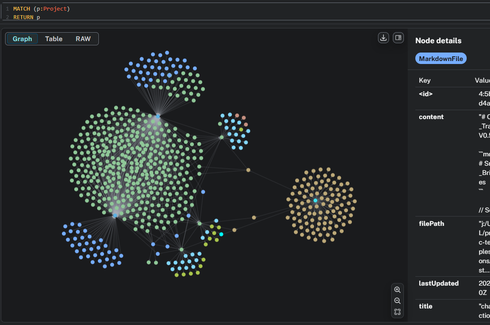
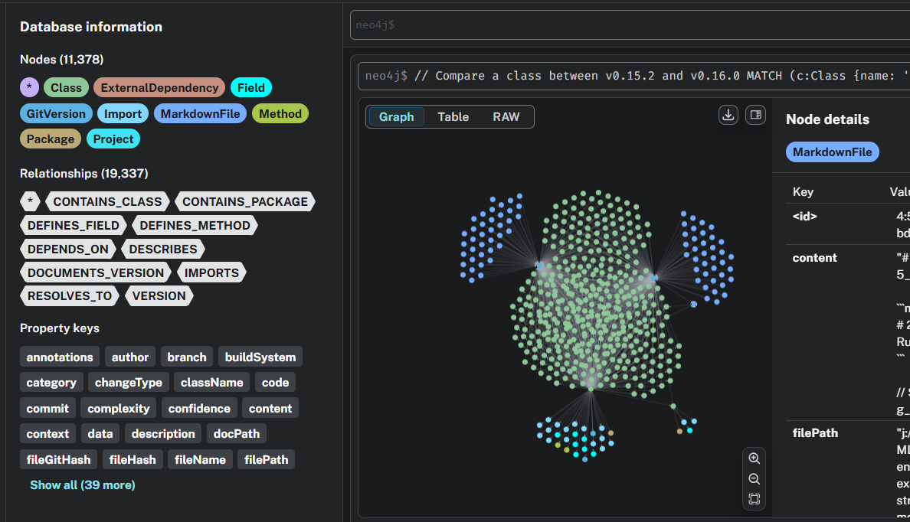

# Graph-Backed Java Test Generation

[](https://opensource.org/licenses/MIT)
[](https://www.python.org/downloads/)
[](https://neo4j.com/)

Reference implementation for building a graph-backed workflow around Java test assets, Neo4j, and MCP-driven developer assistance.

## Overview

This repository packages a clean, publishable starting point for teams that want to:

- inventory Java test assets before ingestion,
- model code relationships in Neo4j,
- expose graph context through MCP-compatible tooling,
- reuse prompt templates for structured test generation workflows.

The current codebase focuses on the pieces that are useful in a public standalone repository: connection management, project preflight scanning, sample assets, notebooks, templates, and integration guidance.

## Why It Matters

Large Java test environments typically combine Ant builds, TOML-driven configuration, framework-specific classes, and hand-built generation workflows. That combination makes onboarding, queryability, and automation harder than it should be.

This project shows a practical path to make those assets easier to inspect and operationalize with graph storage and LLM tooling, without tying the repository to proprietary code or internal process documentation.

## Included Capabilities

- Neo4j connection wrapper with environment-based configuration.
- Project preflight scanning for Java source files and Ant build dependencies.
- Cypher query execution helpers and a database health check.
- MCP integration guidance for wiring graph tools into VS Code.
- Prompt templates and sample Java/TOML assets for experimentation.
- Notebook examples for walkthroughs and exploratory usage.

## Architecture



At a high level, the workflow is:

1. Inspect a Java project and its build configuration.
2. Persist relevant code relationships in Neo4j.
3. Expose curated graph queries through MCP.
4. Use those results to drive assisted code generation.



Additional implementation notes are in [docs/ARCHITECTURE.md](docs/ARCHITECTURE.md) and [docs/MCP_INTEGRATION.md](docs/MCP_INTEGRATION.md).

## Repository Layout

```text
.
├── README.md
├── GETTING_STARTED.md
├── LICENSE
├── CONTRIBUTING.md
├── SECURITY.md
├── pyproject.toml
├── requirements.txt
├── configs/
│   └── .env.example
├── docs/
│   ├── ARCHITECTURE.md
│   └── MCP_INTEGRATION.md
├── examples/
│   ├── 01_quick_start.ipynb
│   ├── 02_advanced_queries.ipynb
│   ├── 03_mcp_code_generation.ipynb
│   └── sample_project/
├── src/
│   └── neo4j_agent.py
├── templates/
│   ├── AnalogTestCase.prompt.md
│   └── GenericTestMethod.prompt.md
└── tests/
    └── test_neo4j_agent.py
```

## Quick Start

See [GETTING_STARTED.md](GETTING_STARTED.md) for setup and example commands.

Typical flow:

```bash
python -m venv .venv
source .venv/bin/activate
pip install -r requirements.txt
cp configs/.env.example .env
python src/neo4j_agent.py preflight \
  --version v1.0.0 \
  --project-path examples/sample_project \
  --build-xml-path examples/sample_project/build.xml
```

## Example Commands

Check database connectivity:

```bash
python src/neo4j_agent.py health-check --env-file .env
```

Run a Cypher query:

```bash
python src/neo4j_agent.py query \
  --env-file .env \
  --cypher "MATCH (n) RETURN count(n) AS total"
```

## Scope

This repository is intentionally positioned as a clean starter and reference implementation. It does not include proprietary source code, internal process notes, or interview-oriented artifacts.
