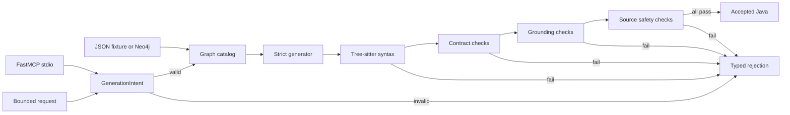

# Architecture

## Purpose

The system converts one of three bounded natural-language request forms into graph-cited Java. It returns source only after syntax, framework-contract, graph-grounding, and source-safety checks pass. Unsupported or unsafe requests return typed errors without source.

## Runtime Path

## Components

### Intent and generation

`src/graph_mcp/workflow.py` owns:

- three anchored intent patterns;
- allowlisted class, package, module, version, and config-path fields;
- graph symbol retrieval;
- deterministic Java rendering;
- Tree-sitter syntax parsing;
- framework-contract, graph-grounding, and forbidden-API checks;
- typed fail-closed responses.

The generator is deterministic. It is not an LLM adapter and does not make model API calls.

### Graph backends

`GraphCatalog` reads the CC0 fixture and calculates its SHA-256. `Neo4jCatalog` provides the same `get` and `search` contract against Neo4j using fixed parameterized Cypher.

The Neo4j adapter:

- permits only `bolt`, `bolt+s`, `neo4j`, and `neo4j+s` URIs;
- rejects credentials embedded in the URI;
- loads credentials from environment variables;
- materializes a fixture without clearing unrelated data;
- rejects an existing fixture identity with a different SHA-256;
- limits graph search to 20 results;
- does not expose raw Cypher through MCP.

### MCP server

`src/graph_mcp/server.py` exposes five tools through the official MCP SDK over stdio. The server selects the fixture backend by default and the Neo4j backend only when `GRAPH_BACKEND=neo4j`.

### Evaluation

`src/graph_mcp/evaluation.py` implements four fixed candidates and the predeclared selection protocol. Development and validation run for all candidates. Confirmation runs only for the selected candidate.

The canonical policy identity combines `strict_graph_v2` with a SHA-256 over the workflow, graph adapter, and MCP server source files.

### Legacy preflight scanner

`src/neo4j_agent.py` remains for the earlier Ant/TOML project snapshot example. It uses `defusedxml` and is not part of the accepted generation path. It does not substantiate MCP generation metrics.

## Data and State

| Artifact | Role | Mutability |
|---|---|---|
| `fixtures/synthetic_graph.json` | Versioned CC0 framework catalog | Immutable identity by SHA-256 |
| `fixtures/evaluation_cases.json` | 96 synthetic requests and split metadata | Deterministically generated |
| `fixtures/java_framework/` | Seven CC0 compile stubs | Source controlled |
| Neo4j fixture subgraph | Live backend representation | Idempotent materialization |
| `evidence/evaluation_trace.json` | Case-level outcomes | Regenerated by evaluation |
| Generated Java | Tool response / temporary compile input | Not persisted by server |

The MCP server performs no source writes and executes no generated Java.

## Trust Boundaries

1. **MCP client to intent parser:** untrusted strings are length and character constrained.
2. **Intent parser to graph:** version and symbol names are selected by code, not open Cypher.
3. **Graph to generator:** only seven required symbol records become imports.
4. **Generator to caller:** source is returned only after all validators pass.
5. **Credentials:** Neo4j secrets remain process environment values and are excluded from evidence.

## Failure Semantics

Representative codes include:

- `unrecognized_intent`
- `invalid_class_name`
- `invalid_package_name`
- `invalid_config_path`
- `unsafe_config_path`
- `unsupported_version`
- `missing_graph_context`
- `generated_source_rejected`
- `invalid_source_size`

No fallback silently converts an unsafe request into accepted source in the selected policy.

## Deployment Boundary

The repository includes a non-root Linux image, localhost-bound Neo4j Compose service, and CI runtime gates. Local Windows validation used a portable Neo4j Community instance because the available Docker daemon supported Windows containers only. No production deployment or SLO is claimed.